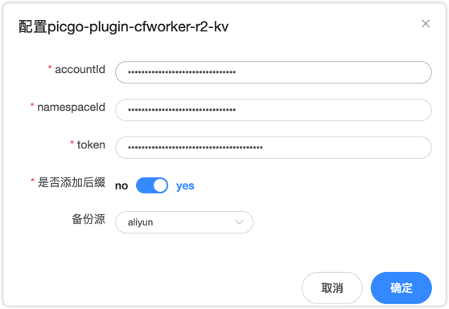

## picgo-plugin-picgo-plugin-cloudflare-kv-backup

cloudflare-kv-backup

你可以选择配置任意的存储第三方图床存储图片, 然后开启本插件, 在插件配置中, 配置 cf 的 kv 数据库中所需要的参数



| 参数        | 描述                                                                         |
| ----------- | ---------------------------------------------------------------------------- |
| accountId   | cf 账户 ID                                                                   |
| namespaceId | kv 数据库需创建的 namespace 的 ID                                            |
| token       | 一个可以授权 token 可以读写 kv 数据库                                        |
| overwirte   | 重写用户图片名称,防止重复, 如果用户已经在 Picgo 上设置了随随机后置, 可以置否 |
| backup      | 备份到指定图床                                                               |

调试所需.env 配置文件, 默认的本分存储我使用的是阿里云的 OSS:

```conf
# aliyun oss config
accessKeyId=
accessKeySecret=
bucket=
area=
path=
customUrl=
option=
# cloudflare-kv-backup
accountId=
namespaceId=
token=
overwrite=
backup=
```
